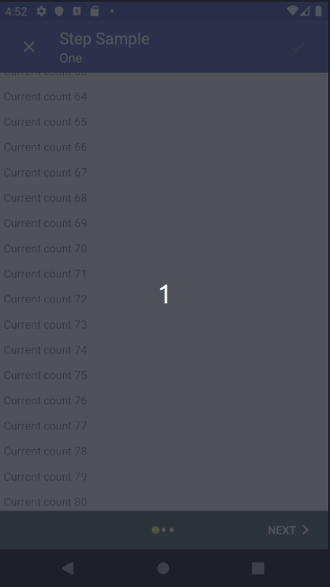
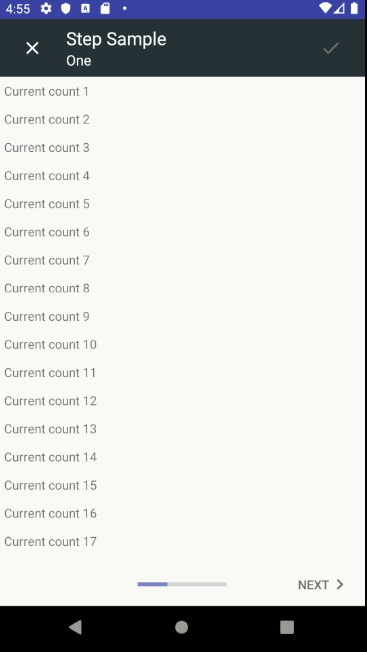
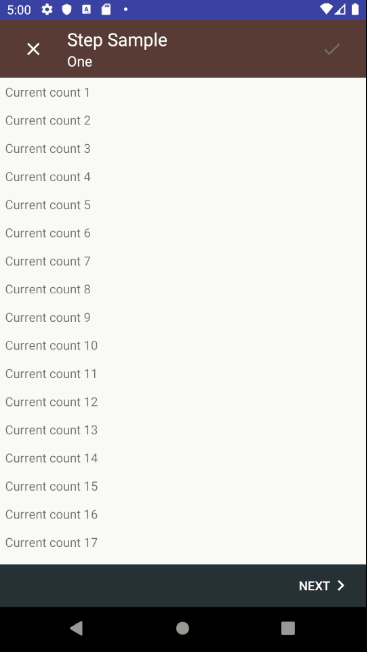
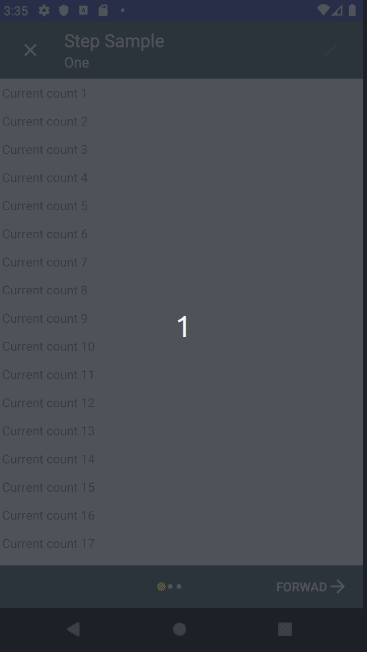
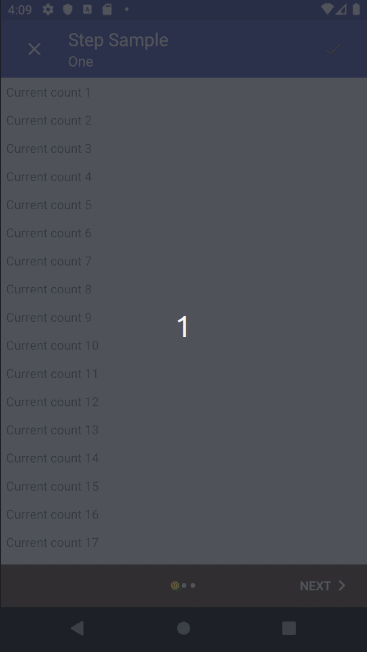

  
# Neat Android Stepper  
  
A Library that allows you to implement android stepper in your application.   
Steppers are used to display progress of logically separated sections normally referred to as `steps`. This library was inspired by stepstone-tech [Android Material Stepper Library](https://www.google.com/design/spec/components/steppers.html)  
  
Code & features mentioned in [Getting started](#getting-started) are showcased in the sample app.  
  
## Jump to section  
- [Supported features](#supported-features)  
- [Getting started](#getting-started)  
- [Contributing](#contributing)  
  
## Supported features  
  
### NeatStepper with dots and progress bar<br/>  
&nbsp;&nbsp;  
  
### NeatStepper without a progress indicator <br/>  
  
  
- Customize labels for bottom navigation buttons  
- Change drawable/images for the complete and exit buttons  
- Change color for the toolbar and bottom navigation colors  
- Change the drawables for the next and previous buttons  
- Customize the above settings for individual steps  
- Switch between dotted_indicator (Recommended for fewer fragments) and progress bar indicator (Supports many fragments)  
- Customize the color for the progress indicator indicator   
- Show or hide toolbar/bottom navigation   
    
## Getting started  

### Download (From GitHub Packages)
This library is available as a git package [Neat Stepper Packages](https://github.com/ellykits/neat-android-stepper/packages). 
At the moment GitHub requires you to authenticate to download Android Libraries hosted on GitHub packages. To do so you will need your **personal access token** and your GitHub **username**. Follow these steps to add the library as a dependency to your app.

**Step 1** : Generate a Personal Access Token for GitHub [How to generate GitHub personal access token](https://help.github.com/en/github/authenticating-to-github/creating-a-personal-access-token-for-the-command-line)

**Step 2** : Store your GitHub — Personal Access Token details 

Add these content to the **`local.properties`** file inside the root directory of your project. 
.
```
gpr.usr=YOUR_GITHUB_USERID
gpr.key=YOUR_PERSONAL_ACCESS_TOKEN
```
**Step 3** : Update `build.gradle` for the application module

```groovy
//For publishing dependency to GitHub package
def githubProperties = new Properties()
//Read the github properties content
githubProperties.load(new FileInputStream(rootProject.file("local.properties")))

android {
     //...
     // include inside the android closure
    repositories {  
      maven {  
              name = "GitHubPackages"  
              /**  
             * Configure path of the package repository on Github using the GITHUB_USER_ID and * Git Repository */  
              url = uri("https://maven.pkg.github.com/ellykits/neat-android-stepper")  
              credentials {  
                  /** get credentials from local.properties in root project folder file with  
                 ** gpr.usr=GITHUB_USER_ID & gpr.key=PERSONAL_ACCESS_TOKEN otherwise ** Set env variable GPR_USER & GPR_API_KEY**/  
                  username = githubProperties['gpr.usr'] ?: System.getenv("GPR_USER")  
                  password = githubProperties['gpr.key'] ?: System.getenv("GPR_API_KEY")  
             } 
        }
    }
    //...
}

```
Add the library in the dependency section of your application's `build.gradle` file. Update the version accordingly 
```groovy
dependencies {
	//consume library - use the latest version available on github packages
	implementation "com.nerdstone:neat-android-stepper:1.0.5"
	//....

}
```
### Create layout in XML  
The layout can only be used as a rootview and should not be nested inside other views.  
```xml  
<?xml version="1.0" encoding="utf-8"?>  
<com.nerdstone.neatandroidstepper.core.widget.NeatStepperLayout xmlns:android="http://schemas.android.com/apk/res/android"  
    xmlns:app="http://schemas.android.com/apk/res-auto"  
    android:id="@+id/neatStepperLayout"  
    android:layout_width="match_parent"  
    android:layout_height="match_parent"  
    app:bottom_navigation_background_color="@color/colorBlueGrey"  
    app:dot_indicator_default_color="@color/colorWhite"  
    app:dot_indicator_selected_color="@color/colorYellow"  
    app:indicator_type="dot_indicator" />  
```  
  
See complete list of supported attributes [Neat Stepper layout attributes](#neat-stepper-layout-attributes)  
  
### Create step Fragment(s)  
Step fragments must extend [androidx.fragment.app.Fragment](http://developer.android.com/reference/android/support/v4/app/Fragment.html)  
and implement `com.nerdstone.neatandroidstepper.core.stepper.Step`  
  
```kotlin  
class StepOneFragment : Step {  
  
    constructor()  
  
    constructor(stepModel: StepModel) : super(stepModel)  
  
    override fun onCreateView(  
        inflater: LayoutInflater, container: ViewGroup?, savedInstanceState: Bundle?  
    ): View? {  
        val view = inflater.inflate(R.layout.fragment_step_one_fragment, container, false)  
        val linearLayout = view.findViewById<LinearLayout>(R.id.fragmentLinearLayout)  
        for (i in 1..200) {  
            val text = TextView(context)  
            text.setPadding(16, 16, 16, 16)  
            text.text = "Current count $i"  
            linearLayout.addView(text)  
        }  
        return view  
    }  
  
    override fun verifyStep(): StepVerificationState {  
        TODO("not implemented")  
    }  
  
    override fun onSelected() {  
        TODO("not implemented")  
    }  
  
    override fun onError(stepVerificationState: StepVerificationState) {  
        TODO("not implemented")  
    }  
}  
```  
  
### Set adapter in Activity  
Activity must extend [androidx.fragment.app.FragmentActivity](https://developer.android.com/reference/androidx/fragment/app/FragmentActivity)  
  
You can also choose to implement stepper callback methods declared in `com.nerdstone.neatandroidstepper.core.domain.StepperActions`on the activity . The callback methods are called anytime the user interacts with the stepper for instance when the user clicks a button. Use the callbacks to handle any operations like saving data to database, requesting resource etc.  
  
Call the method `setUpViewWithAdapter` of the stepper layout and pass the list of fragments to the constructor of `com.nerdstone.neatandroidstepper.core.stepper.StepperPagerAdapter`. This will set up the stepper view with the provided list of Fragments.  
  
```kotlin  
class MainActivity : FragmentActivity(), StepperActions {  
  
    lateinit var neatStepperLayout: NeatStepperLayout  
  
    override fun onCreate(savedInstanceState: Bundle?) {  
        super.onCreate(savedInstanceState)  
        setContentView(R.layout.activity_main)  
        neatStepperLayout = findViewById(R.id.neatStepperLayout)  
        neatStepperLayout.stepperActions = this  
        neatStepperLayout.setUpViewWithAdapter(  
            StepperPagerAdapter(  
                supportFragmentManager,  
                mutableListOf(  
                    StepOneFragment(StepModel.Builder().title("Step Sample").subTitle("One").build()),  
                    StepOneFragment(StepModel.Builder().title("Step Sample").subTitle("Two").build()),  
                    StepOneFragment(StepModel.Builder().title("Step Sample").subTitle("Three").build())  
                )  
            )  
        )  
    }  
  
    override fun onStepError(stepVerificationState: StepVerificationState) {  
    }  
  
    override fun onButtonNextClick(step: Step) {  
    }  
  
    override fun onButtonPreviousClick(step: Step) {  
    }  
  
    override fun onStepComplete(step: Step) {  
        Toast.makeText(this, "Stepper completed", Toast.LENGTH_SHORT).show()  
    }  
  
    override fun onExitStepper() {  
        val confirmCloseDialog = AlertDialog.Builder(this)  
        confirmCloseDialog.apply {  
            setTitle("Confirm close")  
            setMessage("All the unsaved data will get lost if you quit")  
            setPositiveButton("Exit") { _, _ -> finish() }  
            setNegativeButton("Cancel") { _, _ -> return@setNegativeButton }  
            create()  
        }  
        confirmCloseDialog.show()  
    }  
  
    override fun onCompleteStepper() {  
        Toast.makeText(this, "Completed entire step", Toast.LENGTH_SHORT).show()  
    }  
}  
```  
  
### Customizing Stepper  
In case you need different labels for the Next and Back buttons or if you want to change the images for the exit and complete button you can use the `StepperModel` Builder class. Alternative you can define the desired attributes on the `xml` layout.  
To do this programmatically  instantiate the `StepperModel` class using its builder and update the `stepperModel` property of `NeatStepperLayout` with the new class you just created.  
  
<p></p>  
  
```kotlin  
neatStepperLayout = findViewById(R.id.neatStepperLayout)    
val stepperModel: StepperModel= StepperModel.Builder()    
  .completeButtonLabel("DONE")    
  .nextButtonLabel("Foward")    
  .previousButtonLabel("Back")    
  .nextButtonDrawableResource(R.drawable.ic_arrow_forward)    
  .previousButtonDrawableResource(R.drawable.ic_arrow_back)    
  .toolbarColorResource(R.color.colorBlueGrey)    
  .changeDotIndicatorColors(R.color.colorWhite, R.color.colorYellow)    
  .bottomNavigationColorResource(R.color.colorBlueGrey)    
  .indicatorType(StepperModel.IndicatorType.DOT_INDICATOR)    
  .build()    
neatStepperLayout.stepperModel = stepperModel  
```  
In layout:  
```xml  
 <?xml version="1.0" encoding="utf-8"?>    
    <com.nerdstone.neatandroidstepper.core.widget.NeatStepperLayout xmlns:android="http://schemas.android.com/apk/res/android"    
      xmlns:app="http://schemas.android.com/apk/res-auto"    
      android:id="@+id/neatStepperLayout"    
      android:layout_width="match_parent"    
      android:layout_height="match_parent"    
      app:bottom_navigation_background_color="@color/colorBlueGrey"    
      app:dot_indicator_default_color="@color/colorWhite"    
      app:dot_indicator_selected_color="@color/colorYellow"    
      app:toolbar_color="@color/colorBlueGrey"    
      app:next_button_label="Forwad"    
      app:previous_button_label="Back"    
      app:next_button_drawable_end="@drawable/ic_arrow_forward"    
      app:previous_button_drawable_start="@drawable/ic_arrow_back"    
      app:complete_button_label="DONE"    
      app:indicator_type="dot_indicator" />  
```  
  
### Customizing individual steps  
  
You can also customize the appearance of individual steps for instance change the the bottom navigation background color or even change the labels for the  buttons per step. You can also pass the `title` and `subTitle` (optional) properties for the steps. This can be done through the step's Builder class `com.nerdstone.neatandroidstepper.core.model.StepModel`; passed to as parameter to the `Fragment` implementing `com.nerdstone.neatandroidstepper.core.stepper.Step`  
  
  
```kotlin  
   //...  
neatStepperLayout.setUpViewWithAdapter(    
   StepperPagerAdapter(  supportFragmentManager,    
        mutableListOf(    
           StepOneFragment(StepModel.Builder()    
              .title("Step Sample")    
              .subTitle("One")    
              .bottomNavigationColorResource(R.color.colorBrown)    
              .build()),    
           StepOneFragment(StepModel.Builder()    
              .title("Step Sample")    
              .subTitle("Two")    
              .bottomNavigationColorResource(R.color.colorDarkBlue)    
              .build()),    
           StepOneFragment(StepModel.Builder()    
              .title("Step Sample")    
              .subTitle("Three")    
              .bottomNavigationColorResource(R.color.colorBlack)    
              .build())    
       )  
   )  
)  
    //...  
  
```  
  
  
### Hiding bottom navigation bar and ToolBar  
Bottom navigation bar and toolbar are shown by default. To  
hide the bottom navigation bar you can do that by either setting  
the `show_bottom_navigation_buttons` attribute in XML to `false`  
or by setting it programmatically by calling ```StepperModel.Builder()#showBottomNavigationButtons(boolean)```  
with `false`.   
  
## Neat Stepper layout attributes  
  
### View attributes  
A list of base Neat Stepper layout attributes used for UI configuration.  
  
| Attribute name                  | Format                                                              | Description |  
| --------------------------------|---------------------------------------------------------------------|-------------|  
|previous_button_label           |  string    | Label for the previous button       |  
|complete_button_label       |  string        |  Label for the complete button     |  
|toolbar_color          |  color     |     Android resource color for ToolBar Defaults to `#3F51B5` |  
|bottom_navigation_background_color    |  color     |  Android color resource id for bottom navigation bar defaults to `android.R.color.transparent` |  
|next_button_drawable_end     |  reference  |  Image drawable for the next button |  
|previous_button_drawable_start       |  reference  |  Image shown next to the previous button    |  
|exit_button_drawable        |  reference  |  Image for the button used to exit the stepper view |  
|complete_button_drawable     |  reference  |  Image for the complete button available on the toolbar |  
|show_bottom_navigation_buttons       |  boolean       |  Flag to indicate whether to display the bottom navigation bar  |  
|show_toolbar           |  boolean|   |  Use to hide/show the toolbar   |  
|show_progress_indicator      |  boolean       |     Use to hide/show progress indicator|  
|indicator_type             |  enum: either of `dot_indicator` `progress_bar_indicator`| Used for choosing the type of progress indicator|  
|dot_indicator_default_color      |  color     |   Android color resource applied on the unselected dots in the dot indicator    |  
|dot_indicator_selected_color     |  color     |  Android color resource set on the selected dot of the dot indicator    |  
  
## Contributing  
All contributions are welcome and encouraged!  
  
If you wish to contribute please create an issue first explaining the proposed changes or fixes.